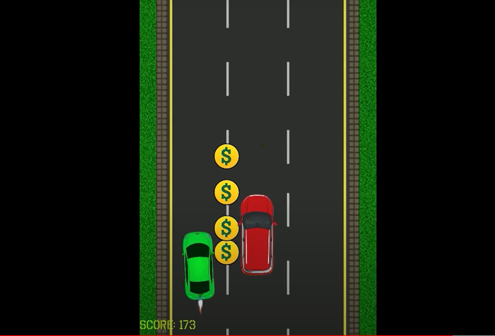

# 2D CAR GAME WITH SDL AND C++

## ANIMATION

## STACKS
Visual Studio
C++
[SDL Version 2.26.4](https://github.com/libsdl-org/SDL/releases/download/release-2.26.4/SDL2-devel-2.26.4-VC.zip)

## ABOUT THE GAME
The car has to avoid incoming obstacles. As the game progresses, the cars come in at a higher speed and the player has the task
of avoiding the incoming obstacles while getting as many coins along the way if the high score is to be beaten.

The player has a choice of three lanes in bid to avoid the incoming vehicles and to get the coins...

## Class Description
### Car
The Car class is simply responsible for the car that is being controlled. The main player car

### Game
The Game class harmonizes all the classes and coordinates the state of all the classes at every instance of the game

### Map
The Map Class controls the general view of the Game area, i.e . the lane and the boundary wall

### Situation
The Situation class controls the incoming cars and coins. They are stored in a container while they are in view and deleted
for efficient memory management once they go out of view

### Texture
The Texture class basically derives texture from the Images in the assets folder

## For Developers who want to contribute to the repository

If you are a C++ developer and you would love to contribute to this game. Check out the already existing issues or create issues of your own. I would love to 
hear from you... :+1:

### How to get started
1. Clone this repository
2. Download the [SDL Library Package](https://github.com/libsdl-org/SDL/releases/download/release-2.26.4/SDL2-devel-2.26.4-VC.zip)
3. You can watch this [video](https://youtu.be/YrWQsuDT3NE) to set up SDL and SDL Image for Visual Studio 
